Game Design Document

Grupo 19

JeR –2025

# **Game Design Document (GDD)**

Ponying around!

Juegos en Red

Grado en Diseño y Desarrollo de Videojuegos 2025-2026

Íñigo García Griñolo
Óscar Pinadero Quintana
Silvia Álvaro Curiel
Julia Moya Sánchez
Henar San Román Santamaría

# **Índice**

- [Índice ............................................................................................................. 2 ](#_page1_x82.00_y130.00)
- [Introducción ................................................................................................ 3 ](#_page2_x82.00_y180.00)
- [Información General ..................................................................................... 3 ](#_page2_x82.00_y332.00)
    1. [Nombre del juego ................................................................................ 3 ](#_page2_x82.00_y359.00)
    2. [Género y dimensión ............................................................................. 3 ](#_page2_x82.00_y428.00)
    3. [Plataforma .......................................................................................... 3 ](#_page2_x82.00_y569.00)
    4. [Audiencia Objetivo ............................................................................... 3 ](#_page2_x82.00_y637.00)
- [Mecánicas y Jugabilidad ............................................................................ 4 ](#_page3_x82.00_y105.00)
    1. [Jugabilidad .......................................................................................... 4 ](#_page3_x82.00_y152.00)
    2. [Mecánicas Principales ......................................................................... 4 ](#_page3_x82.00_y388.00)
    3. [Controles ............................................................................................ 5 ](#_page4_x82.00_y80.00)
    4. [Diagrama de flujo ................................................................................. 6 ](#_page5_x82.00_y105.00)
- [Arte y Diseño Visual (Bocetos y Modelados) ................................................ 7 ](#_page6_x82.00_y80.00)
    1. [Interfaces ............................................................................................... 7 ](#_page6_x82.00_y120.00)
    2. [Entornos ............................................................................................. 8 ](#_page7_x82.00_y105.00)
    3. [Recolectables ................................................................................... 10 ](#_page9_x82.00_y80.00)
    4. [Bocetos de Personajes ....................................................................... 11 ](#_page10_x82.00_y304.00)
    5. [Logo del juego ................................................................................... 16 ](#_page15_x82.00_y259.00)
- [Sonidos y efectos sonoros ....................................................................... 18 ](#_page17_x82.00_y80.00)
    1. [Música .............................................................................................. 18 ](#_page17_x82.00_y120.00)
    2. [Efectos de sonido .............................................................................. 18 ](#_page17_x82.00_y196.00)
- [Narrativa ................................................................................................ 18 ](#_page17_x82.00_y434.00)
    1. [Historia ............................................................................................. 18 ](#_page17_x82.00_y481.00)
    2. [Personajes ........................................................................................ 18 ](#_page17_x82.00_y733.00)
- [Comunicación ........................................................................................ 19 ](#_page18_x82.00_y377.00)
    1. [Marketing .......................................................................................... 19 ](#_page18_x82.00_y424.00)

## **Introducción**

El juego consistirá en una carrera entre dos jugadores, que manejan a dos ponis, su objetivo será llegar a la meta antes que el contrincante evitando los obstáculos e intentando coger los potenciadores.

Se usará el motor de videojuegos unity y los conocimientos adquiridos en la asignatura para poder lograr un videojuego multijugador.

## **Información General**

### 1. **Nombre del juego**

“Ponying around!”

### 2. **Género y dimensión**

El juego será un videojuego de carreras, concretamente de ponis.

Será en un 2D con una estética de dibujos animados. Contará con un entorno ambientado en el campo, con colores verdes, amarillentos y marrones predominantemente. Además, cada personaje contará con su paleta de colores particular para que se distingan perfectamente y se muestre su estilo único.

### 3. **Plataforma**

El juego estará disponible para PC.

### 4. **Audiencia Objetivo**

El juego tendrá una orientación para el público general, pero más concretamente a un público infantil y forofos de “My Little Pony”, ya que este es la principal inspiración artística para el juego.

## 2. **Mecánicas y Jugabilidad**

### 1. **Jugabilidad**

El jugador podrá escoger entre cinco diferentes ponis, cada uno tematizado por un integrante del equipo, cada uno tendrá una descripción distinta.

El jugador, en la pantalla de jugar verá los ponis puestos en 2D, puestos en una pista que se recorre horizontalmente de derecha a izquierda, los ponis estarán en una profundidad, **sin pantalla dividida**, véase el apartado de bocetos para un croquis sobre esta misma.

A nivel técnico los ponis estarán quietos y será el entorno el que se mueva. El entorno está compuesto por el camino donde habrá vallas de distintos tipos y las frutas (manzana y limalimón), aparte de un fondo para dar ambiente.

Contará con físicas de salto y al tirar las vallas en caso de choque.

### 2. **Mecánicas Principales**

- Salto de vallas: Los jugadores (ponis) deberán esquivar las vallas, de lo contrario, al chocarse con ellas serán ralentizados perdiendo la oportunidad de poder ganar y perdiendo vida.
- Vida: El poni tiene un medidor de vida, que aguanta tres (3) choques de valla antes de desmayarse y abandonar la carrera, provocando que el juego termine y pierda el juego.
- Manzanas: Recuperas vida con ella, aparecen en la pista de carreras de manera pseudoaleatoria\*, al ingerir una, unas estrellas salen del poni durante un segundo a modo de retroalimentación.
- LimaLimón: Fruta especial que te hace inmune a no saltar una valla tanto en la ralentización como en la vida, dura 7.565 segundos activo.

\*Aparecen de manera inteligente, no apareciendo si tienes la vida completa.

### 3. **Controles**

El jugador usará el teclado y el ratón para moverse por los menús del juego y la tecla W o la flecha de dirección hacia arriba para saltar.

De manera adicional se ilustra en este gráfico.

### 4. **Diagrama de flujo**

## 3. **Arte y Diseño Visual (Bocetos y Modelados)**

### 1. **Interfaces**

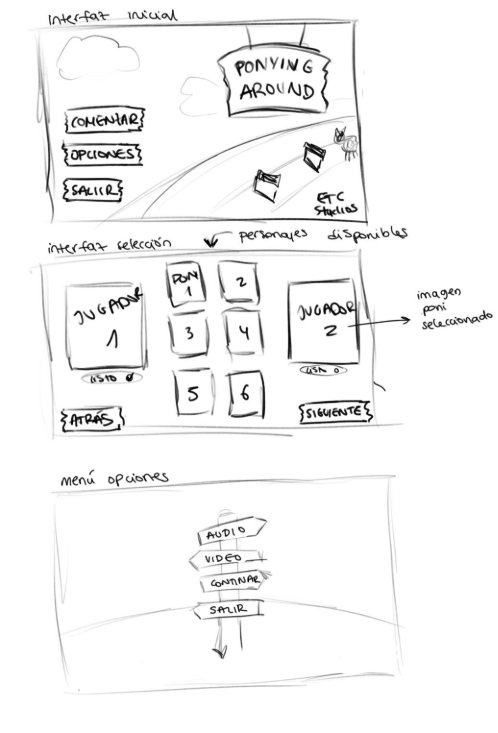

Boceto de pantalla de inicio, pantalla de selección y menú de opciones

### 2. **Entornos**

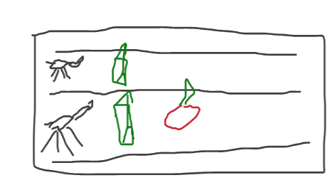

Boceto Inicial de la pista de carreras

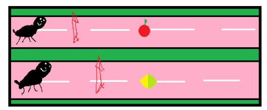

Boceto inicial de la pista de carreras con las frutas “manzana” y “limalimón”

Boceto más visual de la pista de carreras con las frutas “manzana” y “limalimón”

Boceto final de la pista de carreras con las frutas y el contador de vidas.

### 3. **Recolectables**

Bocetos de manzana y limalimón

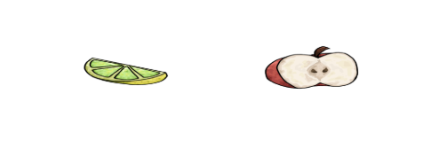

Iconos finales limalimón y manzana

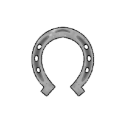

Icono final de la vida de los ponis

### 4. **Bocetos de Personajes**

Bocetos personaje número 1: Beersquiviry

Diseño final personaje número 1: Beersquiviry

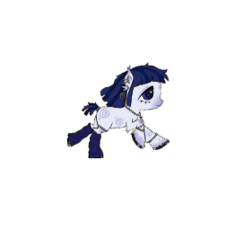

Bocetos personaje número 2: Ache

Diseño final personaje número 2: Ache

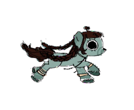
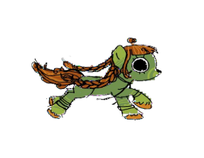

Bocetos personaje número 3: Kamil

Diseño final personaje número 3: Kamil

Boceto personaje número 4: Mayo

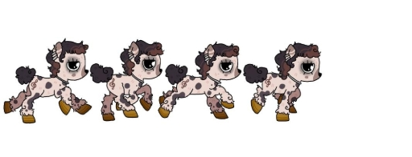

Diseño final personaje número 4: Mayo

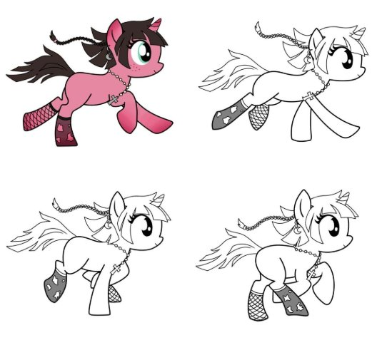

Bocetos personaje número 5: Haiire

Diseño final personaje número 5: Haiire

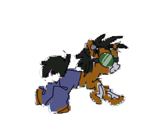

Bocetos personaje número 6: Domdimadon

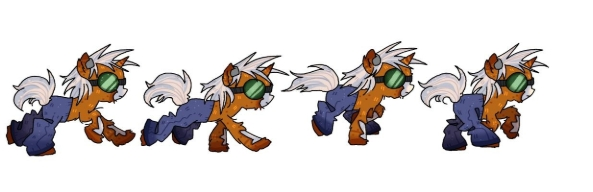

Diseño final personaje número 6: Domdimadon

### 5. **Logo del juego**

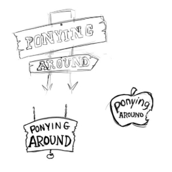

Posibles bocetos

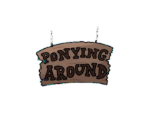

Logo final del juego

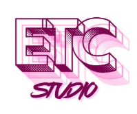

Logo final del estudio

## 4. **Sonidos y efectos sonoros**

### 1. **Música**

La banda sonora constará de música alegre y feliz que acompañe el espíritu de carreras.

### 2. **Efectos de sonido**

Aparte de la música, el juego contará con diversos efectos de sonido que darán más ambiente:

- Al realizar un poni la acción de saltar sonará un sonido similar a la onomatopeya **‘*boing*’**.
- Cuando un poni se dé contra una valla sonará un golpe.
- Al coger una manzana o una limalimón sonará un sonido de comer.
- Al estar en los efectos de limalimón sonará un sonido de potenciación.
- Dándole a los botones para desplazarse por los menús sonará un sonido de **‘*clic*’**.

## 5. **Narrativa**

### 1. **Historia**

La historia sigue de cerca a nuestros ponis, viviendo tranquilamente en Tohelloso, pero una vez al año, un señor obliga a los ponis a correr una carrera a muerte entre los mismos. Este señor, apodado “Melgarga” tiene como misión exterminar a los ponis de una macabra manera, el que pierda será exterminado de una manera horrible, macabra y perturbadora. Utilizando ... ¡Una trituradora! ¿Sobrevivirás?

Imágenes de inspiración de Melgarga

### 2. **Personajes**

- **Haiire**: Se comió una fruta, llamada *cuernocuerno fruit*, esto provocó que brotase un cuerno de su lóbulo frontal, pudiendo tirar rayos desde ahí y provocando una oleada de bulliyng por parte de los secuaces de Melgarga. Ahora busca venganza salvando a los ponis de sus malvadas garras.
- **Domdimadon** : Se comió la fruta después de Haiire, pero a diferencia de ella, es la mascota de Melgarga y por lo tanto no quiere salvar a los ponis.
- **Ache**: Es un poni hipnotizador en aprendizaje que quiere usar sus poderes para vencer a Melgarga.
- **Kamil:** Amante de lo ajeno, corre soltando fanzines por los ojos y patatas de sal y vinagre del ponydona, es acompañada por Mayo, una entidad que a través de la lobotomía que se hizo Kamil se coló en su cuerpo y la controla.
- **Beersquiviry:** Un día, después de una larga fiesta se despertó en la villa de los ponis, corre en cada carrera con la esperanza de salir de la villa y poder volver a su casa a tomarse una cerveza.

## 6. **Comunicación**

### 6.1 **Marketing**

Se decide empezar la fase de marketing en torno a seis (6) meses antes del lanzamiento del juego, con una campaña publicitaria agresiva en todos los medios (Televisión, Redes Sociales, Publicidad en la calle (Paradas de buses, paradas de metro, Buses y carteles en edificios)).

Además, la semana de antes, dos desarrolladores, aparecerá por las calles céntricas de ciudades clave de España haciendo cosplay de su personaje para llamar la atención de los transeúntes e informales acerca del juego.

Se publicarán tres trailers del juego, uno siendo un trailer-gameplay y adicionalmente se publicará un tráiler por cada personaje explorando al mismo.

El objetivo de la campaña es llegar al máximo de personas posibles en el periodo de tiempo que dure la campaña.
19

