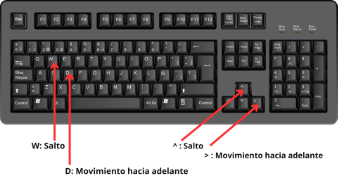
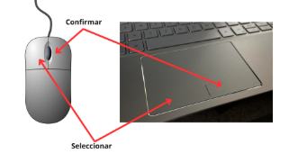
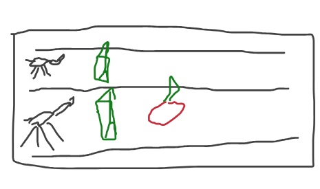
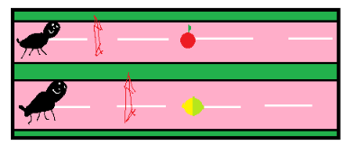
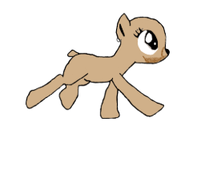
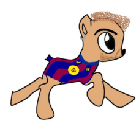

Game Design Document	Grupo 10	JeR –2025

**Game Design Document (GDD)**

Juegos en Red

Grado en Diseño y Desarrollo de Videojuegos 2025-2026

Íñigo García Griñolo

Óscar Pinadero Quintana

Silvia Álvaro Curiel

Julia Moya Sánchez

Henar San Román Santamaría

# **Índice**

[Índice	2](#_toc199991121)

[Introducción	2](#_toc538179254)

[Información General	2](#_toc1302737032)

[1.1 Nombre del juego	2](#_toc455648889)

[1.2 Género y dimensión	2](#_toc1558197167)

[1.3 Plataforma	3](#_toc1541179721)

[1.4 Audiencia Objetivo	3](#_toc1751629515)

[2. Mecánicas y Jugabilidad	3](#_toc1232616242)

[2.1 Jugabilidad	3](#_toc2127675125)

[2.2 Mecánicas Principales	3](#_toc1799308606)

[2.3 Mecánicas Secundarias	4](#_toc1296473470)

[2.4 Controles	4](#_toc1379967515)

[3. Arte y Diseño Visual (Bocetos y Modelados)	4](#_toc334434766)

[3.1 Interfaces	5](#_toc1674867290)

[3.2 Entornos	5](#_toc1767770495)

[3.3 Bocetos de Personajes	5](#_toc516316722)

## **Introducción**

El juego consistirá en una carrera entre dos jugadores, que manejan a dos ponis, su objetivo será llegar a la meta antes que el contrincante evitando los obstáculos e intentando coger los potenciadores.

Se usará el motor de videojuegos unity y los conocimientos adquiridos en la asignatura para poder lograr un videojuego multijugador.

## **Información General**
### **1.1 Nombre del juego**
“Ponying around!”
### **1.2 Género y dimensión**
El juego será un videojuego de carreras, concretamente de ponis.

Será en un 2D con una estética de dibujos animados.
### **1.3 Plataforma**
El juego estará disponible para PC.
### **1.4 Audiencia Objetivo**
El juego tendrá una orientación para el público general, pero más concretamente a un público infantil y forofos de “My Little Pony”.

## **2. Mecánicas y Jugabilidad**
### **2.1 Jugabilidad**
El jugador podrá escoger entre cinco diferentes ponis, cada uno tematizado por un integrante del equipo, cada uno tendrá una descripción distinta.

El jugador, en la pantalla de jugar verá los ponis puestos en 2D, puestos en una pista que se recorre horizontalmente de derecha a izquierda, los ponis estarán en una profundidad, **sin pantalla dividida**, véase el apartado de bocetos para un croquis sobre esta misma.

A nivel técnico los ponis estarán quietos y será el entorno el que se mueva.  
### **2.2 Mecánicas Principales**
- Salto de vallas: Los jugadores (ponis) deberán esquivar las vallas, de lo contrario, al chocarse con ellas serán ralentizados perdiendo la oportunidad de poder ganar y perdiendo vida.

- ` `Vida: El poni tiene un medidor de vida, que aguanta tres (3) choques de valla antes de desmayarse y abandonar la carrera, provocando que el juego termine y pierda el juego.

- Manzanas: Recuperas vida con ella, aparecen en la pista de carreras de manera pseudoaleatoria\*, al ingerir una, unas estrellas salen del poni durante un segundo a modo de retroalimentación.

- LimaLimón: Fruta especial que te hace inmune a no saltar una valla tanto en la ralentización como en la vida, dura 7.565 segundos activo.

\*Aparecen de manera inteligente, no apareciendo si tienes la vida completa
### **2.3 Mecánicas Secundarias**
- NS, ponis supongo.

### **2.4 Controles**
El jugador usará el teclado y el ratón para moverse por los menús del juego y las teclas de movimiento o WADS para mover el poni correspondiente.

De manera adicional se ilustra en este gráfico.

## **3. Arte y Diseño Visual (Bocetos y Modelados)**
### **3.1 Interfaces**
### **3.2 Entornos**

Boceto Inicial de la pista de carreras

Boceto de la pista de carreras con las frutas “manzana” y “limalimón”
### **3.3 Bocetos de Personajes**

Personaje número 1: Osquiviry9

2

